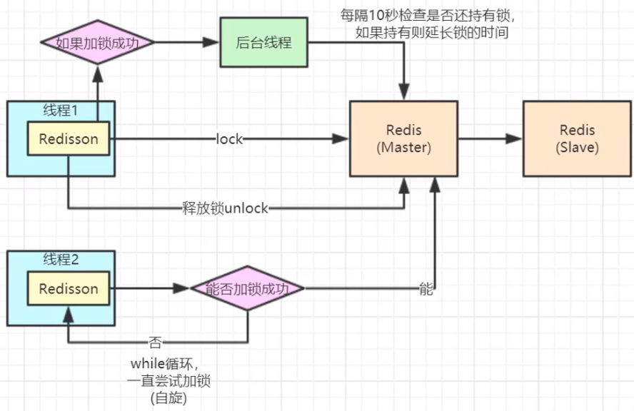

# Redis实现分布式锁

为什么需要锁?

* 多任务环境中才需要； 
* 任务都需要对同一共享资源进行写操作；
* 对资源的访问是互斥的；

过程:

* 任务通过竞争锁资源才能对该资源进行操作(①竞争锁)；
* 当有一个任务再对资源进行更新时(②占有锁)，其他任务都不可以对这个资源进行操作(③任务阻塞)；
* 直到任务完成(④释放锁)；

分布式锁解决方案:

|           | 实现思路                                                     | 优点         | 缺点                                     |
| --------- | ------------------------------------------------------------ | ------------ | ---------------------------------------- |
| mysql     | 利用数据库自身锁机制实现，要求<br>数据库支持行级锁           | 简单，稳定   | 性能差，无法适用高并发，容易死锁，不优雅 |
| redis     | 基于redis的setnx命令实现，通过lua<br>脚本保证解锁时对缓存操作序列的原子性 | 性能好       | 复杂                                     |
| zookeeper | 基于zk的节点特性和watch机制                                  | 性能好，稳定 | 复杂                                     |


Redis加解锁的正确姿势

* 通过setnx命令，必须给锁设置一个失效时间； (避免死锁) 
* 加锁的时候，每个节点产生一个随机字符串(作为lockKey的value) (UUID)；(避免误删锁，即自己线程加的锁，有可能被别的线程删掉)
* 写入随机值与设置失效时间必须是同时的； (保证加锁是原子的)

```java
@RestController
public class RedisLockController {

    @Autowired
    StringRedisTemplate stringRedisTemplate;

    @RequestMapping("/testRedis")
    public String testRedis(){
        String lockKey = "lockKey";
        String clientId = UUID.randomUUID().toString(); //防止 自己线程加的锁，总是有可能被别的线程删掉
        try {
            //设值和设置过期必须是 原子性的操作
            Boolean res = stringRedisTemplate.opsForValue().setIfAbsent(lockKey, clientId, 10, TimeUnit.SECONDS);
            if(!res){
                return "error";
            }
            int stock = Integer.parseInt(stringRedisTemplate.opsForValue().get("stock")); //jedis.get()
            if(stock > 0){
                int newStock = stock-1;
                stringRedisTemplate.opsForValue().set("stock", newStock + "");
                System.out.println("扣减成功, 剩余库存: " + newStock + "");
            }else{
                System.out.println("扣减失败, 库存不足");
            }
        }finally {
            //解锁 , 就是判断这把锁是不是自己加的
            if(clientId.equals(stringRedisTemplate.opsForValue().get(lockKey))){
                stringRedisTemplate.delete(lockKey);
            }
        }
        return "success";
    }
}
```

使用Redisson实现分布式锁:



简单来说: **就是另开一个定时任务延长锁的时间，防止两个线程同时进入**。

```java
@RestController
public class RedissonLockController {

    @Autowired
    Redisson redisson;

    @Autowired
    StringRedisTemplate stringRedisTemplate;

    @RequestMapping("/testRedisson")
    public String testRedis() throws InterruptedException {
        String lockKey = "lockKey";
        String clientId = UUID.randomUUID().toString();
        RLock lock = redisson.getLock(lockKey); // 得到锁
        try {
            lock.tryLock(30, TimeUnit.SECONDS); // 超时时间
            int stock = Integer.parseInt(stringRedisTemplate.opsForValue().get("stock")); //jedis.get()
            if (stock > 0) {
                int newStock = stock - 1;
                stringRedisTemplate.opsForValue().set("stock", newStock + "");
                System.out.println("扣减成功, 剩余库存: " + newStock + "");
            } else {
                System.out.println("扣减失败, 库存不足");
            }
        } finally {
            lock.unlock();
        }
        return "success";
    }
}
```


转载: <https://www.cnblogs.com/linjiqin/p/8003838.html>

我们加锁就一行代码：`jedis.set(String key, String value, String nxxx, String expx, int time)`，这个set()方法一共有五个形参：

- 第一个为key，我们使用key来当锁，因为key是唯一的。
- 第二个为value，我们传的是requestId，很多童鞋可能不明白，有key作为锁不就够了吗，为什么还要用到value？原因就是我们在上面讲到可靠性时，分布式锁要满足第四个条件解铃还须系铃人，通过给value赋值为requestId，我们就知道这把锁是哪个请求加的了，在解锁的时候就可以有依据。requestId可以使用`UUID.randomUUID().toString()`方法生成。
- 第三个为nxxx，这个参数我们填的是NX，意思是SET IF NOT EXIST，即当key不存在时，我们进行set操作；若key已经存在，则不做任何操作；
- 第四个为expx，这个参数我们传的是PX，意思是我们要给这个key加一个过期的设置，具体时间由第五个参数决定。
- 第五个为time，与第四个参数相呼应，代表key的过期时间。

总的来说，执行上面的set()方法就只会导致两种结果：1. 当前没有锁（key不存在），那么就进行加锁操作，并对锁设置个有效期，同时value表示加锁的客户端。2. 已有锁存在，不做任何操作。


